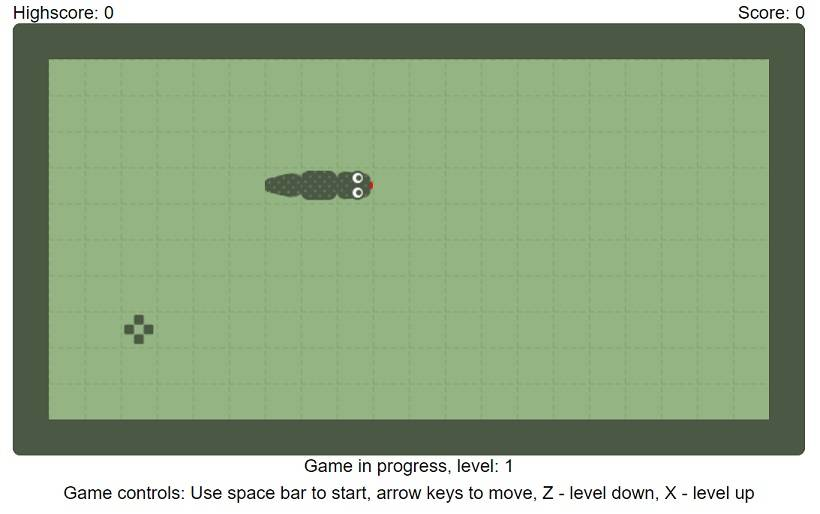

# Retro snake - javascript game
Retro snake game created in javascript. You can play demo on [Snake game](https://snake-gamejs.herokuapp.com/).

## Table of Contents

* [About](#about)
* [Quick Start](#quick-start)
* [Documentation](#documentation)
* [To be done](#to-be-done)

## About



For those who don't know the rules of the game (if they exists), the rules are simple. You need to eat food to grow and avoid hitting the walls and yourself. The bigger you are, the more difficult will be. So, take fun and good luck.

## Quick start
You need to include **snake.css** and **snake.min.js** in your head tag:
```html
<link rel="stylesheet" href="./styles/snake.css" />
<script src="./dist/snake.min.js"></script>
```

Then add game container to body tag:
```html
<div id="game-container"></div>
```

Then you need to initialize game in script tag:
```javascript
function onDocumentLoad() {
   new Game('#game-container');
}
document.addEventListener('DOMContentLoaded', onDocumentLoad);
```
And that's it. See [Documentation](#documentation) section for controls and options.

## Documentation

###### Game controls
- **SPACE BAR** - start game or restart after game over,
- **UP ARROW** - move up,
- **DOWN ARROW** - move down,
- **LEFT ARROW** - move left,
- **RIGHT ARROW** - move right,
- **Z** - decrease game level/speed,
- **X** - increase game level/speed.

###### Options
There is a few options that can be used to change game settings.
```javascript
new Game('#game-container', {SPEED: 5, BOARD_WIDTH: 20, BOARD_HEIGHT: 10});
```
Available options:
- **SPEED** - initial speed for game start (default: 1, range: 1-10),
- **BOARD_WIDTH** - width of the game board (default: 20, range: 10-40),
- **BOARD_HEIGHT** - height of the game board (default: 10, range: 5-20).

## To be done
- game graphics
